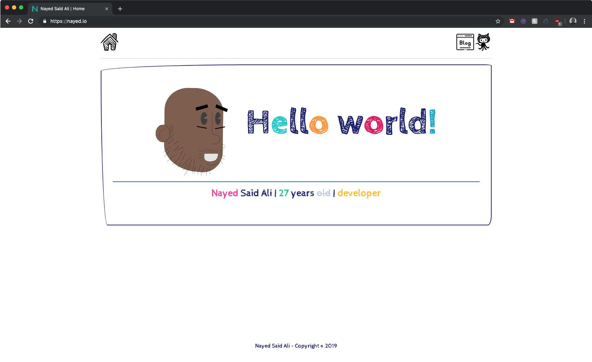
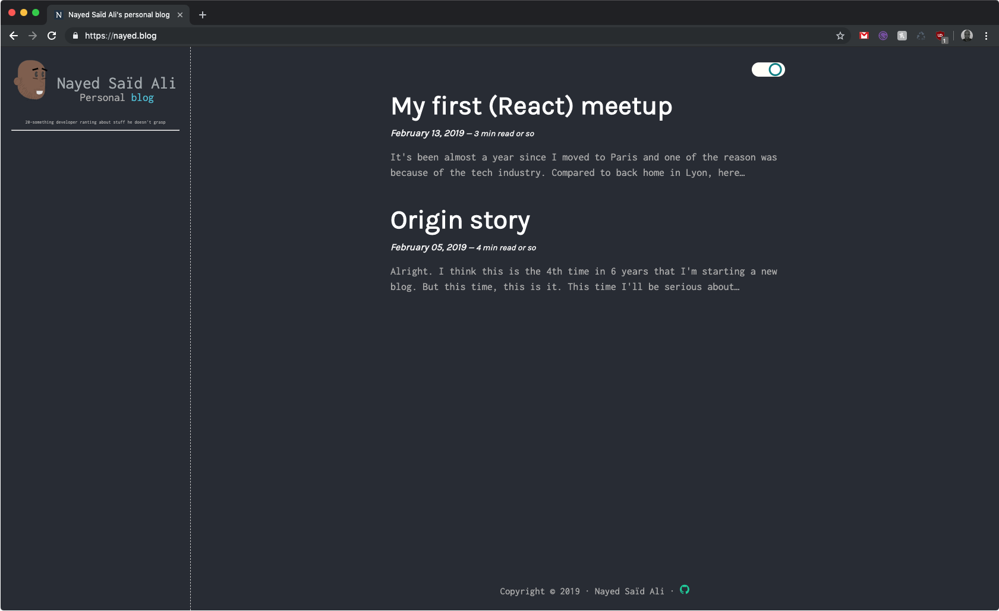
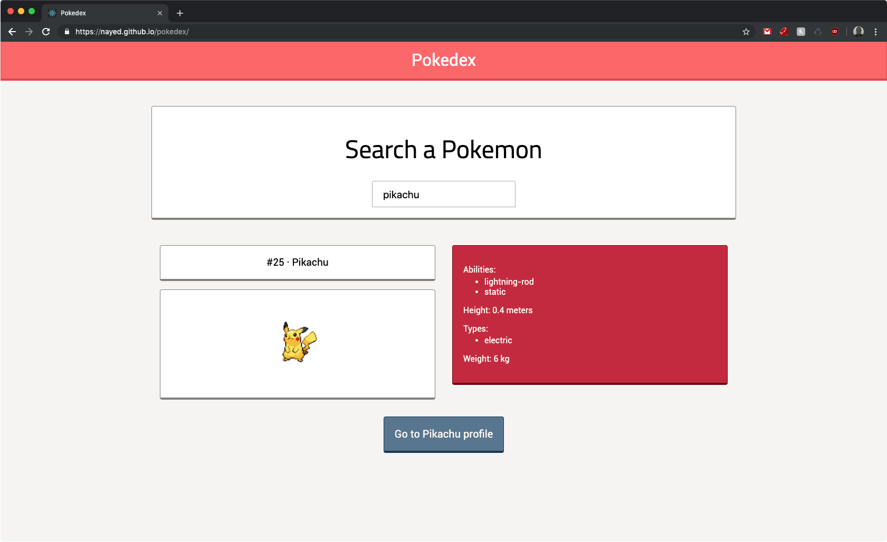
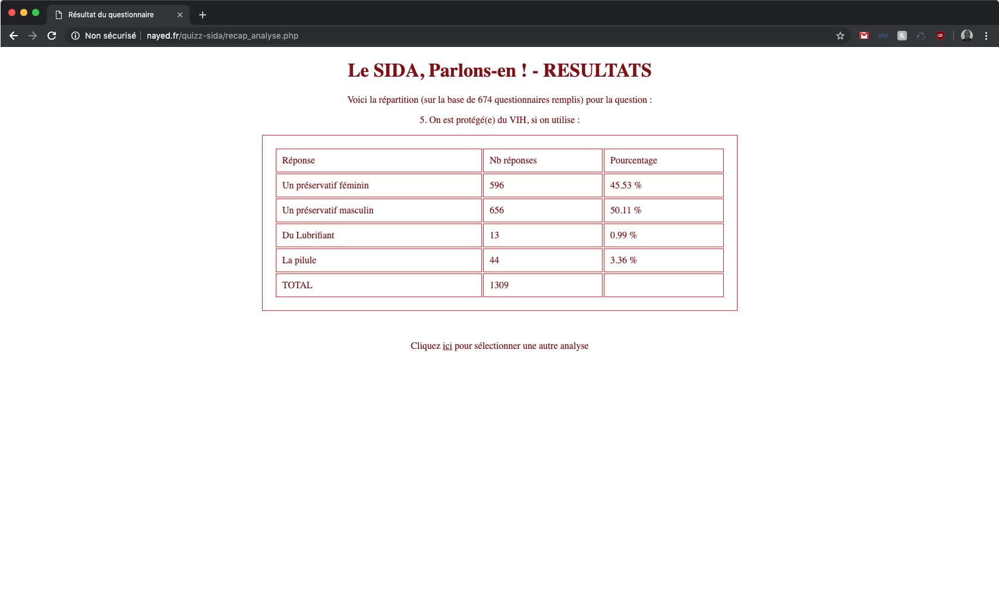
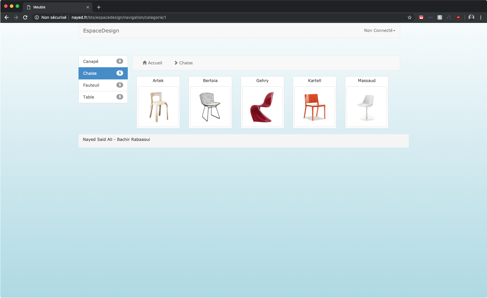

Throughout my still young career I've heard plenty of time stuff like "eww CSS"
"I hate CSS" "I can't design" when talking design with developers and I...

This. This is something I don't get. Because one of the main reason why I'm in
this industry is because 10 years-old-Nayed saw websites that were so awesome he
knew that this is what he wanted to do when growing up. So I'm always wondering
how can people want to work as a ~~software~~ ~~enginer~~ web developer without
liking the design part of the job? Yo how did you end up here, don't tell me
it's because younger you saw databases transactions or tree algorithms and you
were in such awe that it was your call to be a web developer.

So as you can guess, this is a very opiniated post.

Should (web) developers design?

For me, it's a yes. Definitely. But when I'm talking design, I'm not saying devs
should know how to use Photoshop/Sketch/Figma/[insert your favorite design app].
Or not saying they should know how to design
[Awwwards](https://www.awwwards.com) level. Nope. That's not even the same job.
All I'm saying is devs should know basic CSS stuff, how to not make your users
run away of your website because of bad design decision and you should be proud
of your design.

I am not a designer but I believe the design is an important step of the
website. It's how you want people to see what you have envisioned. I know this
is not a simple task but I always try to have different design website to
website. Not to brag (again, I'm not a designer), here are some of my latest
open source toy project:

I am no expert, nor trying to revolutionize the design industry, but I can say
that I'm damn proud of those design and how these website feel.

-

Off course at the beginning of my journey CSS was hard (and still is, let's not
pretend it's an easy programming language because it is not). Here are some of
my first websites when I was in school around 2011-2013 (I think):

Yeah not very attractive isn't it?

In french we have this proverb: « c'est en forgeant qu'on devient forgeron »
which means "practice makes perfect" (the literal translation would be "it's by
smithing that one becomes a blacksmith") and this is also why devs should
design. How can you expect to upgrade your design skills and your design
"sensibility" if you despise and avoid it?

-

Yes, in their own way, developers should design. Again I know this is a very
opiniated view, but for me a web developer that doesn't want to design it's like
a baker that doesn't want to bake. That doesn't make any sense.

Design is the best way to show your user what you have pictured. It is the part
of the iceberg that people will see first. And let's be honest, it feels damn
good to be proud of your own design when showing off.
